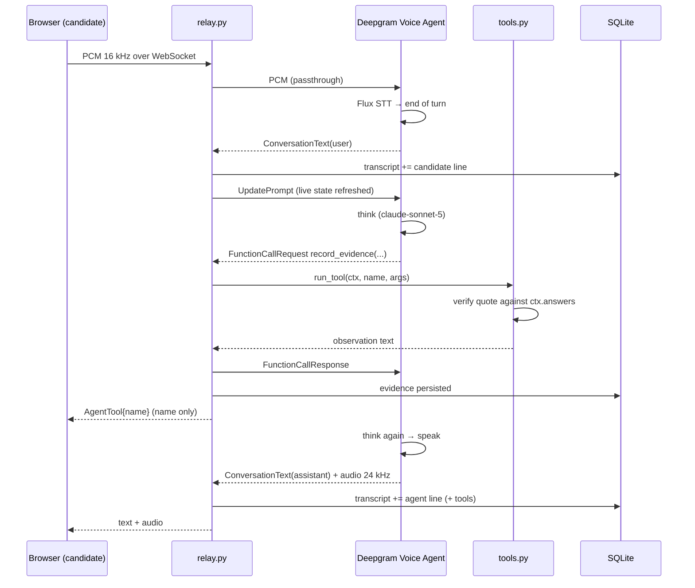
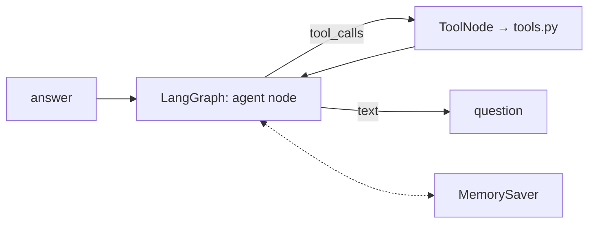

# Architecture

## Voice interview, one turn

The relay never reasons. It moves audio, records what was said, runs tools when
asked, and refreshes the prompt so the model always sees current state. Every
mutation writes through to SQLite; a reconnect replays the transcript into
Deepgram's history and the agent carries on with the evidence it already had.

## Typed path (CLI, evals, mic-failure fallback)

Same `tools.py`, same `render_system_prompt`, same `InterviewContext`, same
`scoring.py`. Only the loop driver differs. The tool-iteration cap is per turn;
when it is hit the model is re-invoked with tools disabled so it must speak.

## Shared state

`InterviewContext` is a plain dataclass: skills, claims, résumé text, evidence,
probe counts, tool log, questions asked, answers given, turn count, stop reason.
Tools mutate it; the prompt is rendered from it; the scorecard is arithmetic over
it. It serialises to JSON, which is the whole persistence story.

Integrity events (tab switches) are kept on `Session`, not on the context, so the
scoring input structurally cannot contain them.

## Deepgram Voice Agent behaviours found by running it

These are not in the docs and each cost real debugging time.

1. **Injected messages queue until the agent has finished speaking.** Sending
   `InjectUserMessage` mid-utterance is accepted silently and never acted on. The
   driver waits on an idle event before injecting.
2. **`AgentAudioDone` only fires while input audio is flowing.** With no
   microphone stream it may never arrive, so the idle event also trips after a
   quiet period.
3. **Protocol pings kill the socket.** The `websockets` client's own keepalive
   policing closes a healthy connection with 1011 because Deepgram does not answer
   pings promptly. Disable it and send Deepgram's `KeepAlive` frame every 5 s.
4. **`temperature` breaks Anthropic think providers.** The failure is a generic
   `Failed to think`. Omit it.
5. **`context_length` is custom-endpoint only.** Managed providers reject it.

Two settings do more than they look like: `eot_timeout_ms` is raised to 8 s so a
thinking pause is not treated as the end of an answer, and `mip_opt_out` is on so
candidate interviews are not training data.
